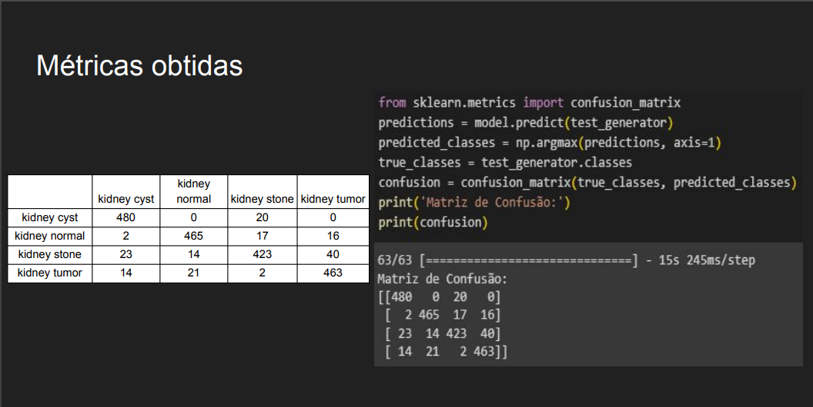

<h1>
     
     RESULTADOS 
</h1>

Resultados das CNN com as metricas

## Objetivo
O objetivo nosso foi de desenvolver uma Convolutional Neural Network (CNN)
E aqui esta o resultados dessas CNN

## RIM DATASET

## CAR DATASET

